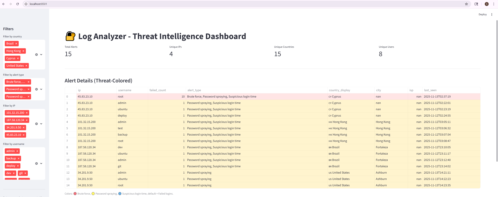
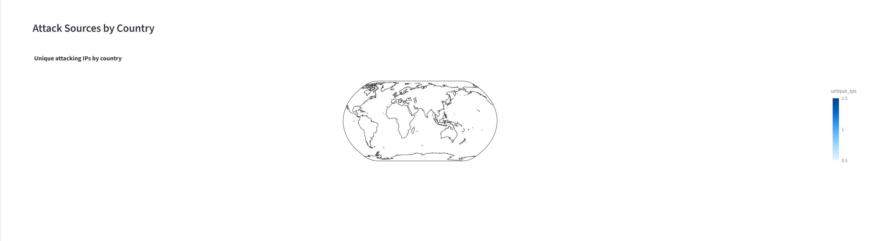

# Log Analyzer – Threat Intelligence Dashboard


---

## Overview

Log Analyzer is a Python-based cybersecurity project designed to parse SSH authentication logs, detect attacker behavior, enrich IP addresses using GeoIP intelligence, and visualize the results through a Streamlit-based Threat Intelligence Dashboard.

This project began as a simple brute-force detection script and has evolved into a complete SIEM-style solution that includes log parsing, detection logic, data enrichment, and interactive visualizations.

---

## Features

### Log Analysis and Detection

- Parses Linux `auth.log`, ISO-style logs, and custom attack files  
- Extracts timestamp, username, IP address, and authentication failure details  
- Aggregates failed login attempts per IP and username  
- Detects:
  - Brute force attacks  
  - Password spraying  
  - Suspicious login times (between 23:00–05:00)  
  - Standard failed login attempts  
- Exports a structured `alerts.csv` file

### GeoIP Threat Intelligence

Enriches each attacking IP address with:

- Country  
- Country code  
- City  
- ISP  

### Streamlit Dashboard

Includes:

- Color-coded alert table  
- Bar charts for top attacking IPs  
- Global map showing attack origins  
- Summary metrics:
  - Total alerts  
  - Unique attacker IPs  
  - Number of countries  
  - Usernames targeted  
- Filters for:
  - Country  
  - Username  
  - IP address  
  - Alert type  

---

## Skills Demonstrated

- Python scripting  
- Regex log parsing  
- Data transformation and normalization  
- GeoIP enrichment  
- Streamlit dashboard development  
- Threat detection engineering  
- SOC-style data analysis and reporting  
- Version control and GitHub documentation  

---

## Project Structure

```
Log-Analyzer/
│
├── analyzer.py
├── alerts.csv
├── attack_logs.txt
├── requirements.txt
│
├── data/
│   └── GeoLite2-City.mmdb
│
├── dashboard/
│   └── app.py
│
└── assets/
    ├── dashboard.png
    ├── table.png
    ├── bar.png
    └── map.png
```

---

## Installation

### 1. Clone the repository

```bash
git clone git@github.com:sxue-03/Log-Analyzer.git
cd Log-Analyzer
```

### 2. Create and activate a virtual environment

```bash
python3 -m venv venv
source venv/bin/activate
```

### 3. Install dependencies

```bash
pip install -r requirements.txt
```

### 4. Add the GeoIP database

Place `GeoLite2-City.mmdb` inside:

```
Log-Analyzer/data/
```

---

## Usage

### Run the analyzer

```bash
python analyzer.py attack_logs.txt
```

This produces `alerts.csv`.

### Launch the dashboard

```bash
streamlit run dashboard/app.py
```

Open in browser:

```
http://localhost:8501
```

---

## Screenshots






---

## Case Study: Multi-Country SSH Attack Simulation

This project includes a simulated attack log that demonstrates brute-force activity and password spraying from multiple countries.

### Highlights

- Brute-force attempts on the `root` account  
- Password spraying across multiple usernames  
- Suspicious late-night login activity  
- Attack origins from:
  - Cyprus  
  - Hong Kong  
  - Brazil  
  - United States  

### Investigation Workflow

1. The analyzer parsed and normalized log entries  
2. Detection logic classified each attacker IP  
3. GeoIP intelligence enriched each event  
4. The dashboard visualized:
   - Attacker patterns  
   - Geographical origins  
   - High-risk IP addresses  

This demonstrates a realistic SOC workflow from log ingestion to incident analysis.

---

## Future Enhancements

- Add command-line arguments to accept log file paths  
- Implement time-window detection logic  
- Export results in JSON for SIEM ingestion  
- Integrate with Wazuh alert logs  
- Add real-time log streaming  
- Extend detection rules with anomaly detection  

---

## License

This project is licensed under the MIT License.

